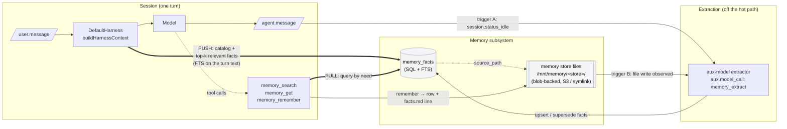
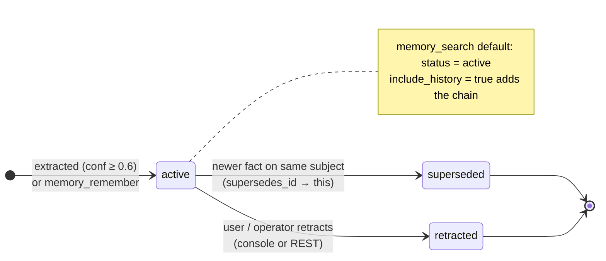
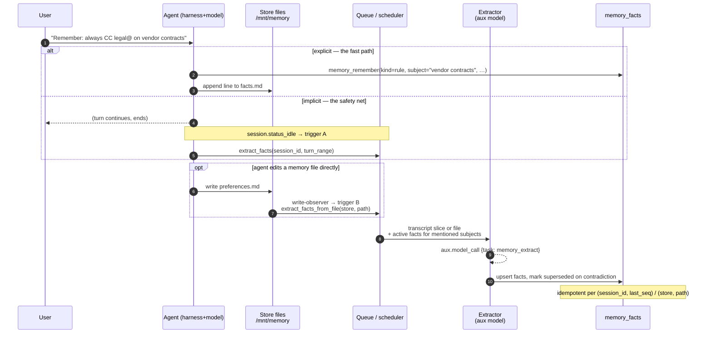
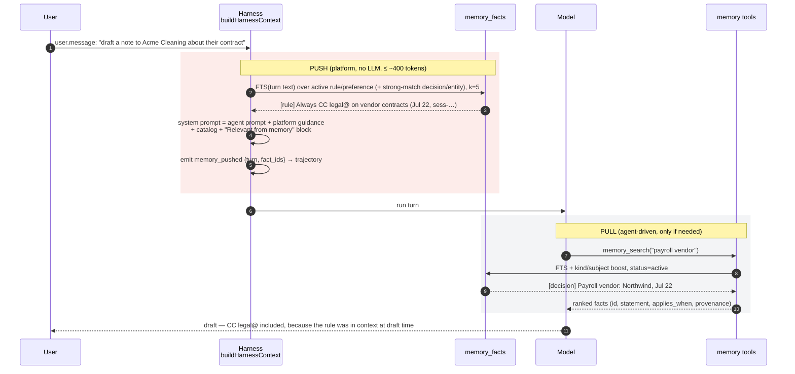
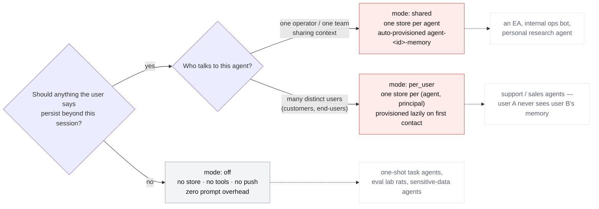
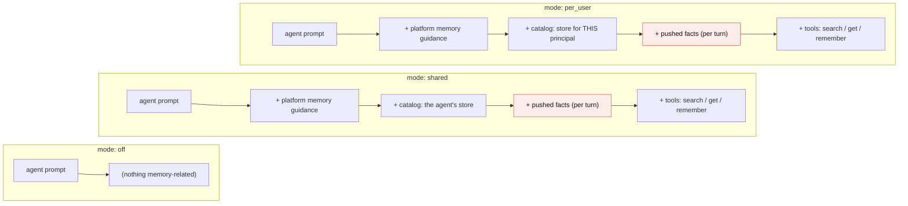
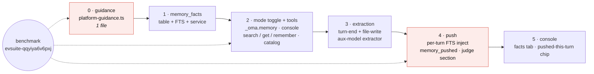

# Cross-Session Memory v2 — Indexed Facts, Push + Pull

Status: **accepted** (2026-07-29). Build started same day. Owner: platform. Extends the existing memory-store
stack (blob-backed stores mounted at `/mnt/memory/<store>/`); replaces nothing.

## 1. Why

The memory-aware simulation (`docs/evals-design.md` simulations; suite
`evsuite-qqyiya6v6pxj`, run `evrun-lkonws93zflnu8rm`, sonnet-4-6 on Daytona) showed
the current memory system's shape precisely:

- **Durability works.** Episode 1 wrote `priya_preferences.md` via the write tool;
  it reached S3 (`syncAfterMutation`); a *fresh* Daytona sandbox in episode 2 pulled it
  back (`syncMemoryStoreFromS3`); the agent read it intact. Every link held.
- **Recall works, but at full-file cost.** To answer "which payroll vendor?", the
  agent `cat`'d the *entire* memory file into context. This is O(store size) per
  recall and will not survive a six-month-old assistant with hundreds of facts.
- **Application fails.** The CC-legal@ rule was in context (turn 1) and was not
  applied to the vendor note drafted in the very next model call. Retrieval ≠
  application. Only a two-episode design with an "unprompted" criterion surfaced it.
- **The default harness gives no guidance.** The DefaultHarness memory reminder says
  only *where* the mount is and whether it is writable; `platform-guidance.ts` has no
  memory guidance at all. The opt-in claude-agent-sdk harness has better text. Two
  harnesses, two behaviors, same feature.

Three commitments follow:

1. **Index durable facts, not sessions.** The unit of memory is a fact (preference,
   decision, standing rule, entity attribute) with the originating session as
   *provenance*. Session summaries are the wrong primitive: a summary can't be written
   at session start, and "which session mentioned payroll?" is a harder query than
   "payroll vendor decision".
2. **Progressive disclosure: the agent gets a map, not the territory.** The system
   prompt carries a ~200-token *catalog* of what memory holds. Retrieval is
   agent-driven through two small tools backed by a queryable table — the agent
   fetches the specific fact it needs, never the store. (Same shape as Claude Code's
   `MEMORY.md` index → per-topic files, and Anthropic's managed-agents memory.)
3. **Push the relevant, pull the rest.** Read-then-ignore is a model-discipline
   problem; presence-in-context at the right moment is a platform problem we can
   solve. Top-k facts relevant to the incoming user turn are *injected*; everything
   else stays pull. This is the change expected to flip `rule-applied-unprompted`.

Explicit design choice: **SQL behind tools, not in front of the model.** A queryable
table is right; handing the agent a schema and asking it to write SQL on every recall
is not (verbose, error-prone, injection-adjacent, and needless — the platform owns
the query surface). Two tools, one catalog line.

### 1.1 System at a glance



Two arrows matter most: **PUSH** (thick, top) is new and is what puts a relevant
standing rule in context *before* the model drafts; **PULL** is agent-driven and cheap.
Extraction never runs inside a turn.

## 2. Inventory (reuse, do not rebuild)

| Exists | Where | Role here |
|---|---|---|
| Blob-backed memory stores, `/mnt/memory/<store>/` mount, S3 sync (Daytona) / symlink (subprocess) | `packages/memory-store`, `packages/sandbox/src/adapters/daytona.ts`, `local-subprocess.ts` | Unchanged. Files remain the durable, human-readable substrate; facts *point at* them. |
| `memories` / `memory_versions` index tables + write-observer (R2 events on CF, chokidar on Node) | `packages/db-schema/src/cf-auth/memory.ts`, `apps/main-node/src/lib/memory-blob-watcher.ts` | Change feed: a file write is the trigger for fact (re)extraction. |
| Session event log + `session.status_idle` in `endTurn` | `packages/session-runtime/src/machine.ts:230` | Turn-end hook for the extraction job. |
| Aux model + `aux.model_call` events (web_fetch summarization precedent) | `apps/agent/src/harness/tools.ts:496`, `packages/api-types` | Cheap platform-internal LLM for extraction and (optional) rerank; usage attributed separately from the agent. |
| `buildNodeMemoryPromptContext` → reminders → `composeSystemPrompt` | `apps/main-node/src/index.ts:3593`, `apps/agent/src/harness/platform-guidance.ts:53` | Where the catalog + pushed facts land in the system prompt. |
| Two-episode memory simulation + `rule-applied-unprompted` / `memory-consulted` criteria | `evsuite-qqyiya6v6pxj`, `packages/evals-runner` simulations | **The acceptance benchmark for this design.** |
| Judge sections `## Prior episodes`, `## Memory store` | `packages/eval-core/.../llm_judge_spec.ts` | Extend with `## Memory facts (pushed)` so the judge sees what the platform injected. |

## 3. Data model

One new table. Facts are derived; the file store remains the source of truth for
content, the fact table is the *index* the tools query.

```sql
CREATE TABLE memory_facts (
  id            TEXT PRIMARY KEY,           -- mfact-<12 alnum>
  tenant_id     TEXT NOT NULL,
  store_id      TEXT NOT NULL,              -- memory_stores.id
  agent_id      TEXT,                       -- extractor's session agent (nullable: REST-authored)
  kind          TEXT NOT NULL,              -- preference | decision | rule | entity | note
  subject       TEXT NOT NULL,              -- short noun phrase: "payroll vendor", "meeting hours", "vendor contracts"
  statement     TEXT NOT NULL,              -- one sentence, self-contained: "Always CC legal@ on any vendor contract."
  applies_when  TEXT,                       -- rule/preference trigger, free text: "drafting or sending vendor contract correspondence"
  confidence    REAL NOT NULL DEFAULT 1.0,  -- extractor confidence 0..1
  status        TEXT NOT NULL DEFAULT 'active', -- active | superseded | retracted
  supersedes_id TEXT,                       -- previous fact this replaces (same subject)
  source_path   TEXT,                       -- memory file path the fact was extracted from (nullable: transcript-only)
  source_session_id TEXT,                   -- provenance
  source_event_id   TEXT,                   -- provenance (agent.message / user.message id)
  observed_at   INTEGER NOT NULL,           -- ms — when the underlying statement happened
  created_at    INTEGER NOT NULL,
  updated_at    INTEGER NOT NULL
);
CREATE INDEX idx_memory_facts_store_status ON memory_facts (store_id, status, updated_at);
CREATE INDEX idx_memory_facts_subject      ON memory_facts (store_id, subject);
-- Search:
--   SQLite: CREATE VIRTUAL TABLE memory_facts_fts USING fts5(subject, statement, applies_when, content='memory_facts', content_rowid='rowid');
--   Postgres: ALTER TABLE memory_facts ADD COLUMN tsv tsvector GENERATED ALWAYS AS
--             (to_tsvector('english', coalesce(subject,'')||' '||coalesce(statement,'')||' '||coalesce(applies_when,''))) STORED;
--             CREATE INDEX idx_memory_facts_tsv ON memory_facts USING gin(tsv);
```

Notes:
- `kind` drives push behavior: `rule` and `preference` are push-eligible on every turn;
  `decision`/`entity`/`note` are push-eligible only at session start / on strong
  match. This is what keeps per-turn injection cheap.
- `supersedes_id` + `status` give a decision history without editing rows: "Northwind
  chosen July 22" stays; a later "switched to Gusto" supersedes it. `memory_search`
  returns `active` by default and can include history on request.
- `source_path` ties a fact to the human-readable file, so a user (or the agent) can
  always open the underlying note; the fact table never becomes a second copy of the
  content the user can't see.
- Facts are **per store** — inheriting the existing tenancy/access model. Read-only
  stores yield read-only facts.

### 3.1 Fact lifecycle



Example chain — "payroll vendor": `Northwind (Jul 22)` **active** → user later says
"we switched to Gusto" → new fact `Gusto` **active**, Northwind → **superseded**,
`supersedes_id` links them. `memory_get(Gusto)` shows the whole history.

## 4. Extraction (writes)

Two triggers, one extractor.

**Trigger A — turn end.** On `session.status_idle` for a session with ≥1 read-write
store attached: enqueue `extract_facts(session_id, turn_range)`. Idempotent per
`(session_id, last_seq)`. Runs off the hot path (Node: the existing work queue /
scheduler; CF: queue consumer). Latency target: facts visible to the *next* session
within seconds; not required within the same session (the agent already has that
context).

**Trigger B — memory file write.** The write-observer already reflects
`/mnt/memory` writes into `memories`/`memory_versions`. Add a fan-out: on a text file
change under a store, enqueue `extract_facts_from_file(store_id, path)`. Facts
extracted from a file carry `source_path`; re-extraction of the same path
**supersedes** that path's prior facts (diff by `subject`), so edits to
`preferences.md` keep the index consistent.

**Extractor.** Aux model (cheap tier; the same resolution as web_fetch summarization),
prompt: transcript slice or file → JSON array of `{kind, subject, statement,
applies_when?, confidence, observed_at?, source_event_id?}`, with the rubric:
- Only *durable* facts: would this still be true and useful in a month? Skip task
  chatter, one-off requests, greetings.
- Statements must be self-contained (no "this", "that", "the vendor").
- Prefer fewer, higher-confidence facts. `confidence < 0.6` → dropped.
- Detect supersession: if the slice contradicts an existing active fact on the same
  subject (the extractor is shown the store's active facts for the subjects it
  mentions), emit `supersedes: <id>`.
Every extractor call emits `aux.model_call {task: "memory_extract"}` so cost is
attributed and visible in the timeline.

**Also: the agent may write facts directly.** `memory_remember(kind, subject,
statement, applies_when?)` — an explicit tool for the moment the user says "remember
this". It writes the fact row *and* appends a line to `<store>/facts.md` (so the file
substrate stays authoritative and human-visible). This is the fast, high-confidence
path; extraction is the safety net for things the user didn't flag.

### 4.1 Write path



## 5. Retrieval (reads)

**Catalog (system prompt, always).** Replaces today's bare mount line:

```
## Memory: <store name> (read-write) — mounted at /mnt/memory/<store>/
Indexed facts: 47 (12 rules · 9 preferences · 21 decisions · 5 entities). Last updated 3d ago.
Use memory_search to look up anything from prior sessions before asking the user to
repeat themselves; use memory_remember when the user states a durable preference,
rule, or decision. Standing rules from memory apply to any task they govern —
check them before drafting, sending, scheduling, or deciding.
```

~120 tokens per store, constant in store size. The last sentence is the guidance
today's DefaultHarness lacks; it belongs in `platform-guidance.ts` (harness-agnostic),
with the per-store block from `buildNodeMemoryPromptContext`.

**Tools.**
- `memory_search({ query, kind?, subject?, include_history?, limit? = 5 })` → ranked
  facts `{id, kind, subject, statement, applies_when, observed_at, source_path,
  source_session_id}`. FTS with a `kind`/`subject` boost; ranking is deterministic
  (no LLM) so it's cheap and testable. Optional aux-model rerank behind a flag if FTS
  proves insufficient.
- `memory_get({ id })` → the fact plus its supersession chain and the source file
  excerpt (bounded).
- `memory_remember(...)` (§4).
Registered in `buildTools()` only when ≥1 store is attached; MCP-visible on the SDK
harness through the same in-process server pattern the SDK harness already uses.

**Push (the new part).** In `buildHarnessContext` per user turn:
1. Take the incoming `user.message` text (+ the last agent message for continuity).
2. Query `memory_facts` for the attached stores: all `active` `rule`/`preference` facts
   whose `applies_when`/`subject`/`statement` FTS-match the turn text, plus
   `decision`/`entity` on strong match; cap **k = 5**, ~400 tokens total.
3. Inject as a per-turn reminder block:
   ```
   <source name="memory:relevant">
   Relevant from memory (apply if pertinent; verify with memory_get if unsure):
   - [rule] Always CC legal@ on any vendor contract. (Jul 22, session sess-…)
   - [decision] Payroll vendor: Northwind, decided Jul 22 — closed. (…)
   </source>
   ```
4. Log which facts were pushed as an `aux.model_call {task: "memory_push"}`-adjacent
   event (or a `system.memory_pushed` frame) so the judge and console can see it.

Session start (turn 1) additionally pushes the top-k most recently *observed*
`rule`/`preference` facts regardless of match — the "what you should always know"
briefing — bounded to the same token cap.

### 5.1 Read path — one turn, push then pull



Contrast with today (`evrun-lkonws93zflnu8rm`, episode 2): the agent `cat`'d the whole
file on turn 1, and by the draft on turn 2 the CC rule was in context but not applied.
Push makes the rule *turn-local* — attached to the very message it governs.

## 6. Agent-level memory mode (the on/off toggle)

Cross-session memory is a per-agent capability the operator opts into at creation
(and can change later). It is a **three-state mode**, not a boolean, because "on"
hides the most consequential choice — whose memory is it?

```ts
// AgentConfig (OMA-only → rides the `_oma` wire envelope like harness / reasoning_level)
memory?: {
  mode: "off" | "shared" | "per_user";
  /** Optional explicit store for `shared`; default: auto-provisioned per agent. */
  store_id?: string;
  /** Extraction on turn end (§4 trigger A). Default true when mode ≠ off. */
  extract?: boolean;
  /** Per-turn relevant-fact injection (§5 push). Default true when mode ≠ off. */
  push?: boolean;
}
```

| mode | Store attached to each session | Typical agent |
|---|---|---|
| `off` (default) | none — no tools, no extraction, no push; the session is amnesiac by design | one-shot task agents, evals lab rats, anything handling data that must not persist |
| `shared` | one store per agent, auto-provisioned on first session (`agent-<id>-memory`), read-write for every session | single-operator assistants (an EA, an internal ops bot, a personal research agent) |
| `per_user` | one store per (agent, principal) — partitioned by the calling user / API key; provisioned lazily on first contact | customer-facing agents (support, sales) where user A's preferences must never surface to user B |

Semantics:
- The mode is snapshotted onto the session (`agent_snapshot.memory`) like every other
  config field, so a running session's memory behavior is deterministic even if the
  operator flips the toggle mid-conversation.
- Explicit environment `resources.memory_stores` and per-session attach
  (`POST /sessions/:id/memory_stores`) keep working and **compose** with the mode —
  they add stores; the mode governs the agent's *own* store and the automatic
  behaviors (extraction, push, catalog).
- `off` → the harness registers no memory tools and injects no memory guidance, so
  the system prompt carries zero memory overhead. Attached stores (if any) still mount
  as plain files.
- Switching `shared` → `off` does not delete the store (data is never destroyed by a
  toggle); it detaches. Deletion is an explicit memory-store action.
- Console: a segmented control on the agent create/edit form — **Off · Shared ·
  Per user** — with a one-line hint per option and a "what will be remembered" note
  linking to the store; visible in the agent's YAML as `_oma.memory.mode`. The
  create-with-AI/setup flow proposes a mode based on the agent's stated purpose
  (customer-facing → `per_user`; single operator → `shared`) and asks the user to
  confirm.

Why default `off`: memory is a data-retention decision. Silent persistence of user
statements is the wrong default for a platform whose agents may handle third-party
data; the operator turning it on is the consent boundary. Templates and the setup
flow make turning it on a one-click, well-explained step.

### 6.1 Which mode?



What each session's system prompt receives, by mode:



## 7. Guidance unification

Move memory usage guidance into `platform-guidance.ts` so both harnesses say the
same thing (the SDK harness's `memoryGuidance` becomes a per-store path note only):

- read/search memory at the start of a task and before asking the user to repeat;
- **apply standing rules and preferences from memory to any task they govern**;
- write durable facts as they are learned (`memory_remember`), or by editing the
  memory files.

This is independently valuable and shippable before §3–5; it is also the cheapest
possible A/B on the acceptance benchmark (§9).

## 8. Judge / simulation integration

- Trajectory gains `memory_pushed: [{turn, fact_ids}]` (written by the runtime, read
  by the eval runner's snapshot). Judge prompt gains `## Memory facts pushed to the
  agent` so `rule-applied-unprompted` can distinguish "platform pushed it, agent
  ignored it" (model) from "platform didn't push it" (retrieval gap).
- `simulation.memory_store.seed_files` continue to seed files; the extractor indexes
  them before episode 1 so seeded scenarios test retrieval realistically. Add
  `seed_facts` for cases that need exact control over the index.
- Trace facts gain `memory_searches` / `memory_remembers` counts so
  `memory-consulted` can be checked mechanically.

## 9. Acceptance & measurement

Benchmark: `evsuite-qqyiya6v6pxj` (two-episode EA recall) at `trials: 3`, same agent
(`agent-kpyonymdfui0b53k`, sonnet-4-6), same Daytona environment, judge pinned.
Baseline (today, 1 trial): 0.625 — `rule-applied-unprompted` FAIL, `memory-consulted`
PASS via a full-file `cat`.

| Step | Expected movement |
|---|---|
| §6 guidance only | `rule-applied-unprompted` may flip on some trials; `memory-consulted` unchanged |
| + §3–5 tools + catalog (pull only) | recall cost drops (no full-file cat; check tokens_in); `memory-consulted` via `memory_search` |
| + §5 push | `rule-applied-unprompted` should flip reliably (pass^k) — the fact is in context at draft time by construction |

**Rubric note (2026-07-29, after push shipped).** The original `memory-consulted`
criterion required an *agent-initiated* read of memory. Once push exists that is the
wrong question — a correct, memory-grounded answer with `pushed_fact_ids` non-empty and
`searches: 0` is the *intended* outcome, not a failure. The suite's criterion now reads
"grounded in memory: pushed-and-used OR searched/read before answering; a lucky guess
with neither fails". Recorded here so the benchmark's history is interpretable: the
first post-push run (evrun-v5vnks9oh0h1ueeg) scored 0.625 under the OLD wording with
`vendor-recalled` + `rule-applied-unprompted` both PASS — the memory system worked; the
rubric was measuring a ritual. That run also exposed a real bug: three concurrent
`memory_remember` calls lost a `facts.md` line (read-modify-write race) → fixed with a
CAS-and-retry append (`appendFactsMdLine`), regression-tested.

Add two scenarios to the suite before measuring: (a) a **large store** (200+ seeded
facts) so full-file `cat` becomes visibly costly and pull-vs-push is meaningful; (b) a
**supersession** case (vendor changed between episodes) so `memory_search` returning
`active` only is verified and stale-fact application is graded.

Cost guardrails: extraction runs on the aux tier and only for read-write stores;
per-turn push is a local FTS query (no LLM) and ≤ ~400 tokens; the catalog is
constant-size.

## 10. Build order

| Phase | Scope | Status (2026-07-29) |
|---|---|---|
| 0 | §7 guidance unification: `memoryGuidance` in `platform-guidance.ts`, prepended as the first memory reminder on both harnesses (only when ≥1 store attached — zero cost otherwise) | **shipped** |
| 1 | `memory_facts` table (sqlite migration 0003 w/ FTS5 external-content + triggers; pg migration 0006 w/ generated `tsv` + GIN), `SqlMemoryFactRepo` (dialect-dispatched FTS, score-aware kind boost), service: `rememberFact` / `searchFacts` / `getFact` / `retractFact` / `supersedeFactsFromPath` / `factStats`; 13 tests on real SQLite | **shipped** |
| 2 | `AgentConfig.memory` (`_oma.memory` wire, validated on create/update, snapshotted); `attachAgentMemory` session lifecycle hook + Node `agent-memory-mode.ts` (auto-provision `agent-<id>-memory`, per-user hash names, pin store id back on the agent); tools `memory_search` / `memory_get` / `memory_remember` (registered iff a store is attached; remember also appends `facts.md`); catalog line with per-kind counts; console segmented control (create + edit + detail row) | **shipped** — live-verified: fresh session searched memory unprompted and applied the CC-legal rule |
| 3 | `MemoryExtractionRunner` (debounced turn-end trigger via the session-registry event tap, KV seq cursor for idempotency; file-write trigger via `SqlMemoryRepo.onFileWritten` — one seam covering REST/watcher/queue/S3-poller; aux-model call attributed as `aux.model_call {task: memory_extract}`; eval/sim sessions excluded) | **shipped** — live-verified (correctly no-op'd when the agent had already `memory_remember`'d the same facts) |
| 4 | Push: per-turn FTS of the user message over active facts (+ first-turn rules/preferences briefing), ≤5 facts / ~400 tokens, injected as `memory:relevant`; `system.memory_pushed {fact_ids}` on the session stream; trace facts `memory{pushed_turns, pushed_fact_ids, searches, remembers}`; judge MEMORY line ("pushed-but-ignored = model; never-surfaced = retrieval") | **shipped** — live-verified: "book me a 9am meeting" → 10am preference pushed → agent flagged the conflict unprompted (haiku-4.5) |
| 5 | Console: facts tab on Memory Store detail (kind/subject/statement/provenance, supersession chain, retract), "pushed this turn" chip in the session timeline | not started |

Not yet: SDK-harness MCP parity for the three tools (the SDK harness gets the shared guidance + file mount only); CF runtime (extraction/push are Node-only); `seed_facts` on simulations; the two additional benchmark scenarios (§9).

Each phase re-runs the benchmark; the doc's §9 table is the scorecard.



Highlighted phases are the two that move `rule-applied-unprompted`: guidance (cheap,
maybe) and push (by construction).

## 11. Non-goals (this pass)

- Embedding/vector search. FTS + kind/subject boost first; the benchmark tells us if
  it's insufficient. Vectors are an additive rerank behind the same tools.
- Cross-agent or cross-tenant memory sharing beyond today's store attachment model.
- Replacing files with the fact table. Files stay authoritative and human-readable;
  facts are an index with provenance.
- Automatic conflict resolution between two agents writing the same store
  concurrently — CAS on files stays as is; facts inherit last-writer-wins on
  `subject` with supersession history.
- Session summaries as a memory primitive (see §1 — deliberately rejected).

## 12. Open questions

- **Turn-text for push**: user message only, or user + last agent message? Start with
  user-only + last agent message *if* the user message is short (< 20 tokens, e.g.
  "yes send it").
- **Extractor model tier**: aux tier by default; is `low` reasoning enough for
  supersession detection? Measure false-supersession rate on the supersession
  scenario.
- **Facts on read-only stores**: extract (so `memory_search` works) but forbid
  `memory_remember` — assumed yes.
- **CF parity**: extraction on CF rides the existing memory-events queue consumer;
  push is in SessionDO's turn build. Node-first; CF in phase 3/4 as a follow-up.
